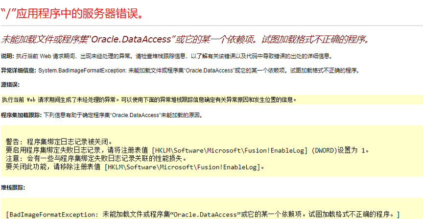
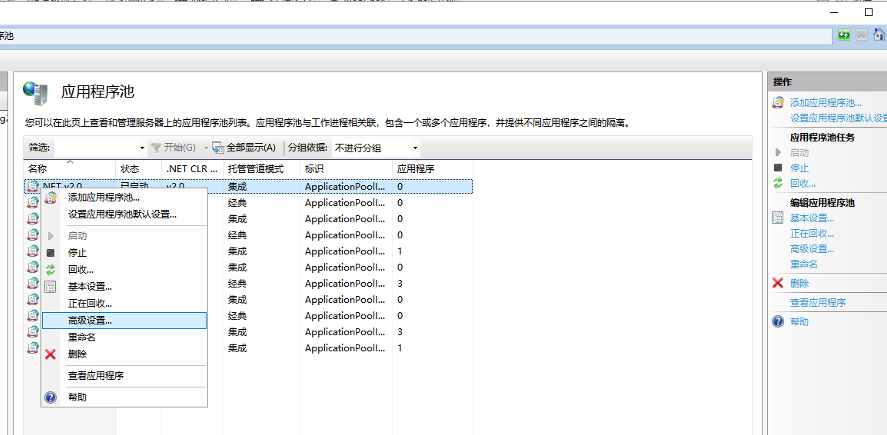
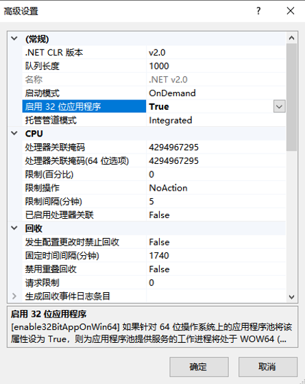
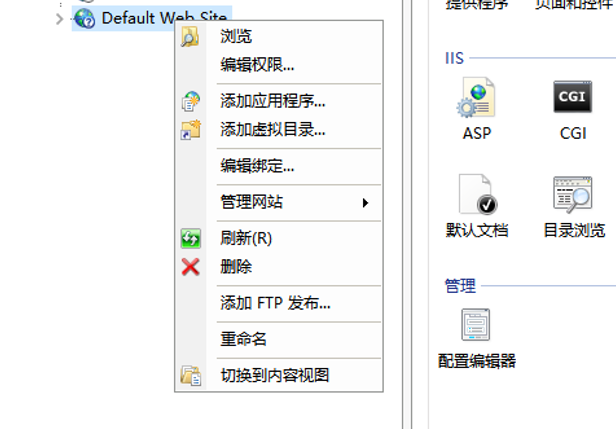
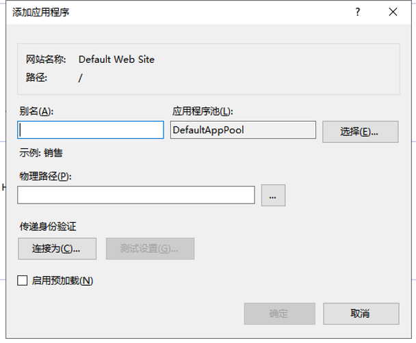
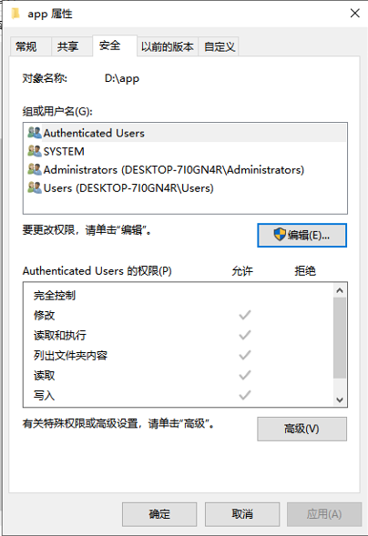
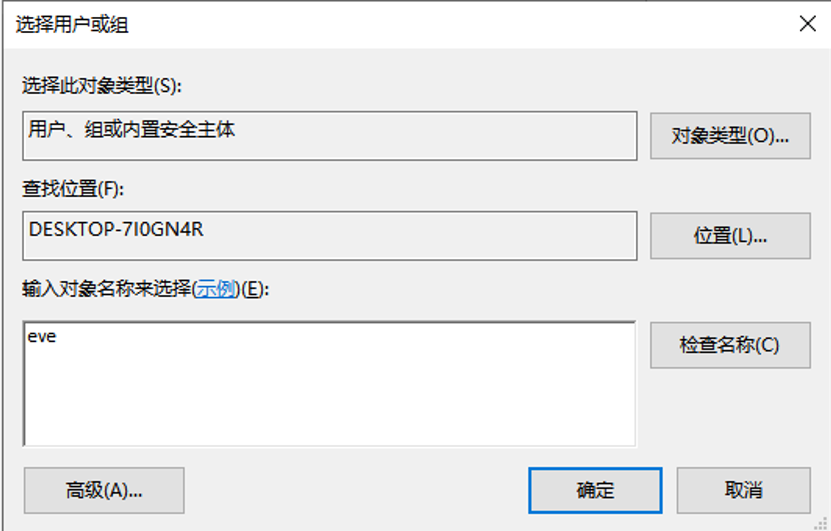
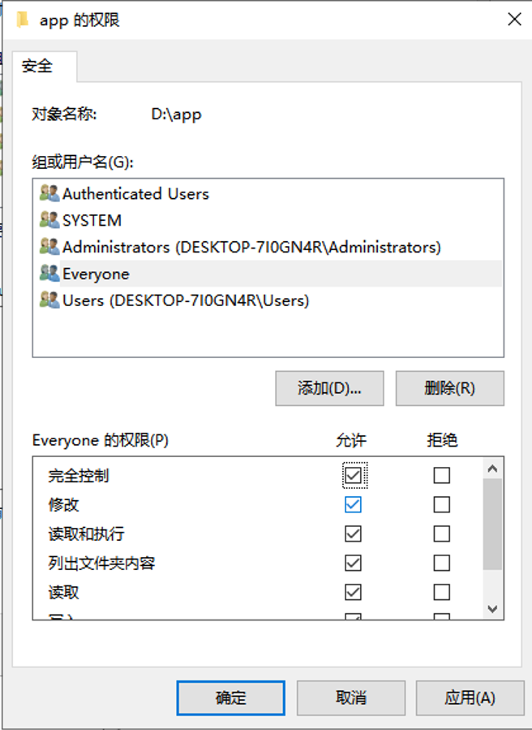
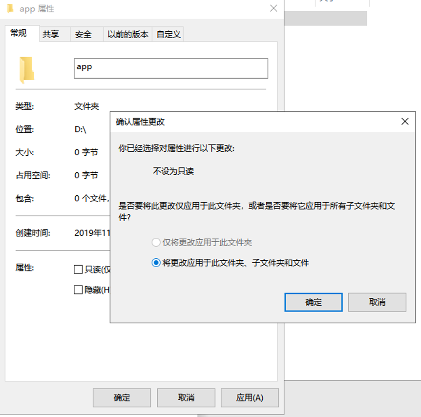

# 配置IIS遇到的坑...

最近维护老项目时碰到了点小麻烦，公司老项目都是前后端不分离的，使用.Net开发，需要配合IIS进行维护。按理说配置是后端的事，但是前端还是需要了解一些...

#### 坑一：未能加载文件或程序集“Oracle.DataAccess”或它的某一个依赖项。试图加载格式不正确的程序。

我这里出现这种情况的原因是IIS是64位的，而工作电脑上装的Oracle是32位的，所以这里需要将网站开启32位模式。

**具体步骤如下：**

> * 1.打开``高级设置``
> 
> * 2.启用32位应用程序即可
> 

或者还有一种麻烦的方法：
> * 1.在发布的网站选择添加应用程序，发布时将其设置为32位即可
> 
> 

#### 坑二：分析器错误信息: 找不到文件或程序集名称“xxxx.dll”，或找不到它的一个依赖项。

出现这个问题可能是文件迁移过来时程序对其没有读写权限，这时需要更改文件的权限，为其添加一个``everyone``的完全读写权限。
**具体步骤如下：**

> * 1.打开文件源文件夹属性的``安全选项卡``，点击编辑
> 
> * 2.添加一个``用户或组``，输入``eve``后确定
> 
> * 3.为其添加``完全控制``以及``修改``的权限
> 
> * 4.并将更改应用到``所有的子文件及子文件夹``
> 
> * 5.之后重启网站即可。

